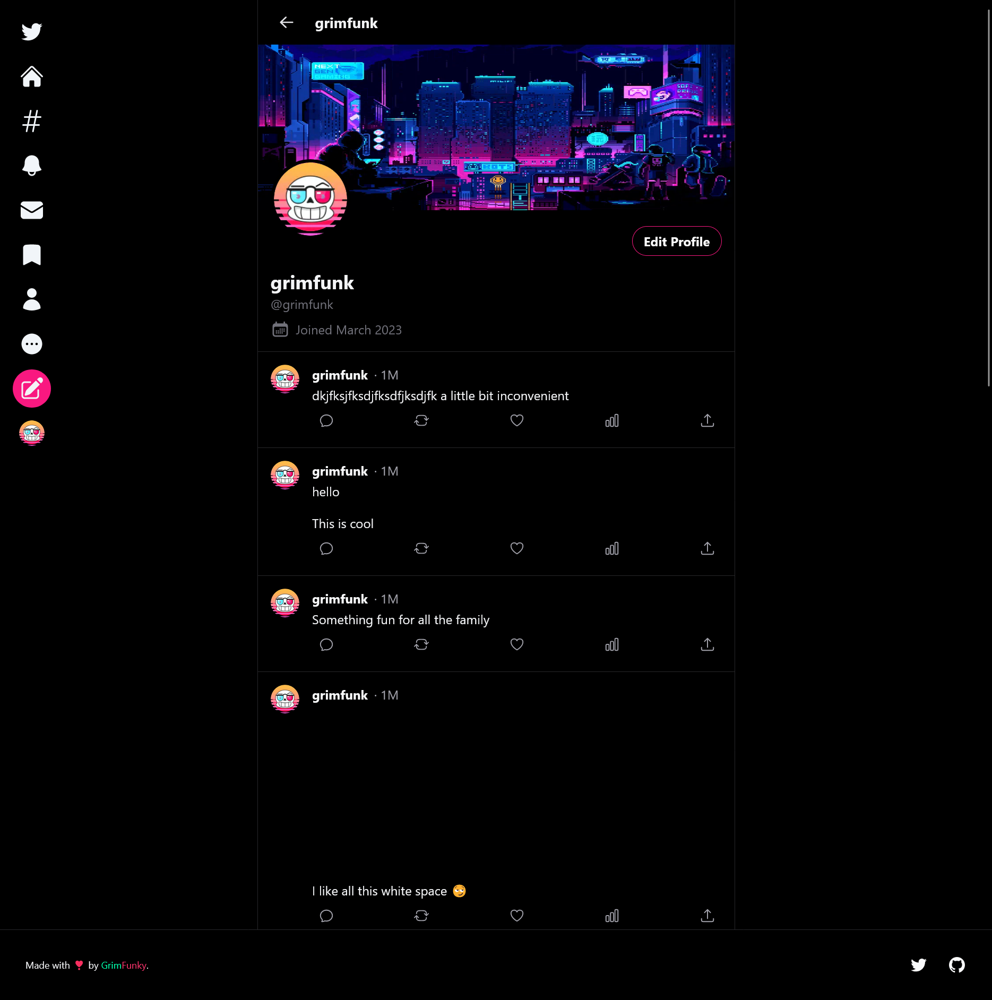

# Twitter T3 Clone

A twitter clone made using the awesome t3 stack!

## Table of Contents 📃

1. [Description](#description)
2. [Screenshot](#screenshots)
3. [Installation](#installation)
4. [Usage](#usage)
5. [Technology](#technology)
6. [Features](#features)
7. [Credits](#credits)
8. [License](#license)
9. [Contribution Guidelines](#contribution-guidelines)
10. [Feedback](#feedback)
11. [Socials](#socials)

## Description

This app was made as I wanted to explore making apps using the T3 stack. It's a CLI app builder that sets up the skeleton of a fully typesafe next js application. I also wanted to play around with using some other integrations like upstash for all the redis stuff like rate limiting, clerk for managing auth and much more!

You can tweet and view your profile and tweets. Will implement likes and comments when I get the time.

[Link to application](https://twitter-t3-clone.vercel.app/)

### What did I Learn 🏫

Main takeaways were learning to use the prisma ORM, tRPC to create typesafe APIs, Clerk for user auth and more!

I also learned how to use:

- Learned more about using NextJS
  - slugs for variable routes for tweets and user profiles
  - How to make a 404 page
  - Using getStaticProps and generateStaticPaths to generate a static page
- Using upstash to implement a redis database for rate limiting
- How to use Planetscale to create and manage a deployed database
- Using create T3 app to scaffold an application
- React Hook Form

## Screenshots

### Web App Screenshot

## Installation

In order to run my site locally then please follow these steps:

1. Ensure that you have node and npm installed

   - [Download Node](https://nodejs.org/en/download/)

   - For detailed instructions on installing node please follow [this link](https://docs.npmjs.com/downloading-and-installing-node-js-and-npm) for instructions

2. Ensure that you know the basics of the nextjs page router

   - Otherwise please follow [this link](https://nextjs.org/docs) and follow the docs for editing any of the pages.

3. Clone this repository into your local repository.

   - `git clone git@github.com:TheInfamousGrim/nextjs-personal-site.git`.

4. Install the dependencies

   - `npm install`

If you've followed these steps correctly then the application should be good to go 😁

## Usage

Link to live application: [Click here](https://twitter-t3-clone.vercel.app/)

Please follow these steps to use the application locally

1. Spin up a developer server using webpack.

   - `npm run dev`

   - this will spin up a server and allow you to hot replace anything if you want to develop on my site further.

2. open a new tab in your browser using the following URL or the one supplied in the terminal

   - `http://localhost:3000/`

## Technology

The technologies used for the development of this app were:

- [Create T3 App](https://create.t3.gg/)

## Features

- SSR & SSG.
- Built using nextjs.
- Tailwind classes so there's no conflicting css.
- Rate limiting thanks to Upstash
- Auth thanks to Clerk
- React Hook Forms to create easy validation and state management.
- Fully animated with the help of Framer Motion.
- Deployed using Vercel.

## Credits

🙏 Made with the help of:

- [Create T3 App](https://create.t3.gg/)

## License

[MIT License](/LICENSE)

## Contribution Guidelines

I'm open to have anyone jump in and contribute just message me on [twitter](https://twitter.com/GrimFunk69)

Please follow the contribution guidelines!
[Guidelines for contributing](/code_of_conduct.md)

## Feedback

Any feedback please email [George Fincher](mailto:george@grimfunky.dev)

## Socials

## Learn More About Create T3 App

To learn more about the [T3 Stack](https://create.t3.gg/), take a look at the following resources:

- [Documentation](https://create.t3.gg/)
- [Learn the T3 Stack](https://create.t3.gg/en/faq#what-learning-resources-are-currently-available) — Check out these awesome tutorials

You can check out the [create-t3-app GitHub repository](https://github.com/t3-oss/create-t3-app) — your feedback and contributions are welcome!

## How do I deploy a T3 App?

Follow our deployment guides for [Vercel](https://create.t3.gg/en/deployment/vercel), [Netlify](https://create.t3.gg/en/deployment/netlify) and [Docker](https://create.t3.gg/en/deployment/docker) for more information.
